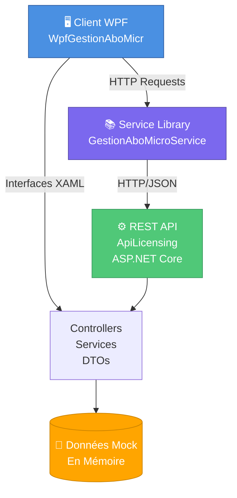

# 📊 Gestion Abonnement Microsoft - Stage

**Application complète de gestion des abonnements Microsoft** composée d'une **API REST** et d'un **client WPF** pour un suivi commercial et financier.

> Projet de stage : gestion des clients, abonnements, factures et historique d'une entreprise de services Microsoft.

---

## 🏗️ Architecture Globale



---

## 📦 Structure des Projets

### 1️⃣ **ApiLicensing** - API REST (ASP.NET Core)

#### 📍 **Fonctionnalités Principales**

| Fonctionnalité | Contrôleur | Endpoints |
|---|---|---|
| **Gestion Clients** | `ClientsController` | `GET /api/clients`, `POST`, `PUT`, `DELETE`, `RECHERCHE` |
| **Gestion Abonnements** | `AbonnementsController` | `GET /api/abonnements`, `POST`, `PUT`, `DELETE` |
| **Gestion Factures** | `FacturesController` | Clients & Fournisseurs, `GET`, `POST`, `PUT`, `DELETE` |
| **Historique** | `HistoriqueController` | `GET /api/historique/client/{id}` |
| **Rapprochement** | `RapprochementController` | `GET /api/rapprochement` |
| **Tests** | `TestController` | Endpoints de test rapide |

#### 🔧 **Architecture des Services**

```
ApiLicensing/
├── Controllers/           ← Points d'entrée HTTP
├── Services/
│   ├── AppService.cs      ← Service principal
│   ├── ClientService.cs   ← Gestion clients
│   ├── ClientAbonnementService.cs  ← Gestion abonnements
│   ├── FactureService.cs  ← Gestion factures
│   ├── HistoriqueService.cs        ← Historique transactions
│   ├── RapprochementService.cs     ← Rapprochement
│   └── DashboardService.cs         ← Calculs KPI
├── DTO/                  ← Modèles d'échange
└── Program.cs            ← Configuration
```

#### 📊 **Données Mock**

L'API utilise des **données en mémoire** pour simulation :

```csharp
// 12 clients de test (Alpha Solutions, Beta Conseil, etc.)
// 16 abonnements associés
// Factures, historique et rapprochements populés
// Dates réalistes (2023-2027)
```

**Avantages :**
- ✅ Test rapide sans base de données
- ✅ Données cohérentes et prévisibles
- ✅ Reset automatique au redémarrage

#### 🔗 **Points d'Accès**

| Environnement | URL | Détails |
|---|---|---|
| **Développement** | `https://localhost:7085` | OpenAPI Scalar disponible |
| **Documentation API** | `/openapi/v1.json` | Schéma OpenAPI 3.0 |
| **Interface Swagger/Scalar** | `/scalar` | UI interactive (dev uniquement) |

---

### 2️⃣ **WpfGestionAboMicr** - Interface Utilisateur (WPF)

#### 🖼️ **Vues et Fonctionnalités**

| Vue | Fichiers | Fonctionnalités |
|---|---|---|
| **Dashboard** | `Dashboard.xaml(.cs)` | 📈 KPI clients, abonnements, factures |
| **Clients** | `Clients.xaml(.cs)` | 👥 CRUD clients, recherche, pagination |
| **Détail Client** | `DetailClient.xaml(.cs)` | 📋 Profil, abonnements, factures, historique |
| **Abonnements** | `ClientAbonnements.xaml(.cs)` | 📦 Gestion des abonnements par client |
| **Facturation** | `Facturation.xaml(.cs)` | 💰 Factures clients & fournisseurs |
| **Rapprochement** | `Rapprochement.xaml(.cs)` | 🔄 Comparaison factures, export CSV |
| **Renouvellement** | `Renouvellement.xaml(.cs)` | 🔁 Suivi renouvellements |
| **Admin** | `Admin.xaml(.cs)` | ⚙️ Test des endpoints API |

#### 📁 **Structure des Fichiers**

```
WpfGestionAboMicr/
├── App.xaml(.cs)         ← Point d'entrée application
├── MainWindow.xaml(.cs)  ← Fenêtre principale + menu
├── ViewModel.cs          ← Logique métier
├── Model.cs              ← Modèles locaux
├── OrderInfo.cs          ← Structure données
├── UserControls/
│   ├── DataCard.xaml     ← Composant réutilisable (carte)
│   ├── MenuLateral.xaml  ← Barre latérale navigation
│   ├── MenuTemplate.xaml ← Template menu
│   └── Vue/              ← Pages principales
│       ├── Dashboard.xaml
│       ├── Clients.xaml
│       ├── DetailClient.xaml
│       ├── ClientAbonnements.xaml
│       ├── Facturation.xaml
│       ├── Rapprochement.xaml
│       ├── Renouvellement.xaml
│       └── Admin.xaml
└── Resources/            ← Ressources visuelles
```

#### 🎨 **Composants Réutilisables**

- **DataCard** : Affiche les KPI de manière stylisée
- **MenuTemplate** : Gère la navigation et l'arborescence des menus
- **MenuLateral** : Barre de navigation latérale

#### 🔄 **Modèles MVVM**

- **ViewModel.cs** : Logique d'application et lien vue-données
- **Model.cs** : Structures métier côté client

---

### 3️⃣ **GestionAboMicroService** - Bibliothèque Service

#### 🎯 **Responsabilités**

```
GestionAboMicroService/
├── AppService.cs         ← Orchestration appelsse au client
├── DTO/                  ← Modèles d'échange
│   ├── ClientDTO
│   ├── ClientAbonnementDTO
│   ├── FactureDTO
│   ├── HistoriqueDTO
│   ├── RapprochementDTO
│   ├── DashboardDTO
│   ├── EvolutionDTO
│   ├── LigneInfoDTO
│   └── RenouvellementDTO
└── Services/
    ├── ClientService.cs
    ├── ClientAbonnementService.cs
    ├── FactureService.cs
    ├── HistoriqueService.cs
    ├── RapprochementService.cs
    └── DashboardService.cs
```

**Fonctions :**
- 🌐 Gestion des requêtes HTTP (GET, POST, PUT, DELETE)
- 🔐 Gestion des erreurs et codes HTTP
- 📦 Sérialisation/Désérialisation JSON
- 🔗 Centralisation des endpoints API

---

## 📊 Modèles de Données (DTOs)

### **ClientDTO**
```csharp
{
  "id": 1,
  "nom": "Alpha Solutions",
  "email": "contact@alpha-solutions.mock",
  "telephone": "01 23 45 67 89",
  "adresse": "12 rue des Mockups, 75000 Paris",
  "contactPrincipal": "Jean Dupont",
  "etatFacturation": "AJour",     // AJour | EnAttente | EnRetard
  "nombreAbonnements": 2,
  "prochainRenouvellement": "15/09/2026"
}
```

### **ClientAbonnementDTO**
```csharp
{
  "id": 1,
  "clientId": 1,
  "typeAbonnement": "Microsoft 365 Business Standard",
  "quantite": 10,
  "dateDebut": "01/01/2024",
  "dateFin": "31/12/2026",
  "prochainRenouvellement": "01/01/2027",
  "statut": "Actif"  // Actif | Expiré | EnAttente
}
```

### **FactureDTO**
```csharp
// Factures Clients
{
  "id": 1,
  "clientId": 1,
  "montant": 5000.00,
  "dateEmission": "01/01/2024",
  "dateEcheance": "01/02/2024",
  "statut": "Payée"
}

// Factures Fournisseurs (structure similaire)
```

### **HistoriqueDTO**
```csharp
{
  "id": 1,
  "clientId": 1,
  "description": "Création client",
  "date": "01/01/2024",
  "type": "Creation"
}
```

---

## 🚀 Guide de Démarrage

### **Prérequis**
- 🔧 **.NET 6.0+** ou **.NET 8.0**
- 💻 **Visual Studio 2022** ou **VS Code**
- 🖥️ **Windows** (pour WPF)
- 📦 **NuGet** packages installés

### **Installation**

#### 1️⃣ Cloner le repository
```bash
git clone <repo-url>
cd GestionAbonnementMicrosoft---Stage
```

#### 2️⃣ Lancer l'API
```bash
cd ApiLicensing
dotnet restore
dotnet run
```
✅ API disponible à `https://localhost:7085`

#### 3️⃣ Lancer le client WPF
```bash
cd WpfGestionAboMicr
# Ouvrir le fichier .sln dans Visual Studio et lancer
```

#### 4️⃣ Accéder à la documentation
- 📖 OpenAPI Scalar : `https://localhost:7085/scalar`
- 🔍 Explorer les endpoints disponibles

---

## 🔌 Endpoints API Complets

### **Clients** (`/api/clients`)
| Méthode | Endpoint | Description |
|---|---|---|
| `GET` | `/api/clients` | Liste tous les clients |
| `GET` | `/api/clients/summary` | Résumé des clients (léger) |
| `GET` | `/api/clients/{id}` | Détail d'un client |
| `GET` | `/api/clients/recherche?q=terme` | Recherche par terme |
| `GET` | `/api/clients/total` | Nombre total de clients |
| `POST` | `/api/clients` | Créer un client |
| `PUT` | `/api/clients` | Modifier un client |
| `DELETE` | `/api/clients/{id}` | Supprimer un client |

### **Abonnements** (`/api/abonnements`)
| Méthode | Endpoint | Description |
|---|---|---|
| `GET` | `/api/abonnements` | Tous les abonnements |
| `GET` | `/api/abonnements/client/{id}` | Abonnements d'un client |
| `GET` | `/api/abonnements/total` | Total abonnements actifs |
| `GET` | `/api/abonnements/actifs` | Nombre abonnements actifs |
| `GET` | `/api/abonnements/recherche?q=E3` | Recherche |
| `POST` | `/api/abonnements` | Créer abonnement |
| `PUT` | `/api/abonnements` | Modifier abonnement |
| `DELETE` | `/api/abonnements/{id}` | Supprimer abonnement |

### **Factures** (`/api/factures`)
| Méthode | Endpoint | Description |
|---|---|---|
| `GET` | `/api/factures` | Toutes les factures clients |
| `GET` | `/api/factures/{id}` | Détail facture |
| `GET` | `/api/factures/client/{id}` | Factures d'un client |
| `GET` | `/api/factures/attente/total` | Factures en attente |
| `GET` | `/api/factures/resume` | Résumé facturation |
| `POST` | `/api/factures` | Créer facture |
| `PUT` | `/api/factures` | Modifier facture |
| `DELETE` | `/api/factures/{id}` | Supprimer facture |
| `GET` | `/api/factures/fournisseurs` | Factures fournisseurs |
| `POST` | `/api/factures/fournisseurs` | Créer facture fournisseur |

### **Historique** (`/api/historique`)
| Méthode | Endpoint | Description |
|---|---|---|
| `GET` | `/api/historique/client/{id}` | Historique d'un client |

### **Rapprochement** (`/api/rapprochement`)
| Méthode | Endpoint | Description |
|---|---|---|
| `GET` | `/api/rapprochement` | Tous les rapprochements |

### **Test** (`/api/test`)
| Méthode | Endpoint | Description |
|---|---|---|
| `GET` | `/api/test/ok` | Test simple OK |
| `GET` | `/api/test/badrequest` | Test BadRequest |
| `GET` | `/api/test/notfound` | Test NotFound |
| `GET` | `/api/test/error` | Test Error 500 |

---

## 📈 Données de Test

### **Clients Mock** (12 clients)
- **Alpha Solutions** - Contact: Jean Dupont
- **Beta Conseil** - Contact: Marie Martin
- **Gamma Industrie** - Contact: Pierre Bernard
- **Delta Services** - Contact: Sophie Leroy
- **Epsilon Informatique** - Contact: Lucas Moreau
- **Zeta Corp** - Contact: Emma Petit
- **Eta Solutions** - Contact: Hugo Simon
- **Theta Group** - Contact: Camille Rousseau
- **Iota Digital** - Contact: Nathan Girard
- **Kappa Tech** - Contact: Léa Lambert
- **Lambda Expert** - Contact: Tom Fontaine
- **Mu Services** - Contact: Inès Chevalier

### **Abonnements Mock** (16 abonnements)
- **Microsoft 365 Business Standard** (quantités variées)
- **Microsoft 365 Business Premium**
- **Microsoft 365 E3**
- **Microsoft 365 E5**

Statuts : `Actif`, `Expiré`, `EnAttente`

---

## 🔧 Configuration

### **appsettings.json** (API)
```json
{
  "Logging": {
    "LogLevel": {
      "Default": "Information",
      "Microsoft.AspNetCore": "Warning"
    }
  },
  "AllowedHosts": "*"
}
```

### **launchSettings.json**
```json
{
  "profiles": {
    "https": {
      "commandName": "Project",
      "launchBrowser": true,
      "launchUrl": "scalar",
      "applicationUrl": "https://localhost:7085",
      "environmentVariables": {
        "ASPNETCORE_ENVIRONMENT": "Development"
      }
    }
  }
}
```

---

## 💡 Cas d'Usage Principaux

### 1️⃣ **Gestion des Clients**
- ✏️ Ajouter/modifier/supprimer des clients
- 🔍 Rechercher par nom, email, téléphone
- 📊 Voir les abonnements associés
- 💰 Vérifier l'état de facturation

### 2️⃣ **Suivi des Abonnements**
- 📦 Créer des abonnements Microsoft 365
- 📅 Suivre les dates d'expiration et renouvellement
- 📊 Compter les licences actives par client
- 🔄 Renouveler les abonnements expirés

### 3️⃣ **Gestion Financière**
- 💵 Enregistrer les factures clients et fournisseurs
- 📊 Suivre les paiements (À jour, En attente, En retard)
- 🔄 Rapprocher factures clients/fournisseurs
- 📈 Consulter le résumé de facturation

### 4️⃣ **Reporting**
- 📊 Dashboard avec KPI globaux
- 📋 Historique des transactions par client
- 🔍 Export des rapprochements en CSV

---

## 🎯 Stack Technologique

### **Backend**
- 🔹 **ASP.NET Core 6.0+**
- 🔹 **C# 11+**
- 🔹 **OpenAPI / Scalar**
- 🔹 **RESTful API**

### **Frontend**
- 🔹 **WPF (Windows Presentation Foundation)**
- 🔹 **XAML**
- 🔹 **C# MVVM**
- 🔹 **Syncfusion** (si graphiques présents)

### **Communication**
- 🔹 **HTTP/HTTPS**
- 🔹 **JSON**
- 🔹 **Entity Serialization**

### **Données**
- 🔹 **En Mémoire** (Mock)
- 🔹 **List<T> / Dictionary<K,V>**
- 🔹 **Persistence : Non** (reset à chaque redémarrage)

---

## 🧪 Tests

### **Endpoints de Test Disponibles**
Utilisez `/api/test/*` pour valider la connexion API.

```bash
# Test de base
curl https://localhost:7085/api/test/ok

# Test avec récupération de clients
curl https://localhost:7085/api/clients

# Test de création (POST)
curl -X POST https://localhost:7085/api/clients \
  -H "Content-Type: application/json" \
  -d '{"nom":"Nouveau Client","email":"nouveau@test.com"}'
```

---

## 📝 Notes de Développement

### **Points Clés**
- ✅ Données **mockées en mémoire** pour développement rapide
- ✅ API **sans authentification** (environnement de test)
- ✅ **CORS** non configuré (API et WPF sur machine locale)
- ✅ **Calcul automatique** des dates (abonnements)
- ✅ **Cascade delete** (suppression client → suppression abonnements)

### **Limitations Actuelles**
- ⚠️ Pas de persistance (base de données)
- ⚠️ Pas d'authentification/autorisation
- ⚠️ Pas de transactions multi-utilisateurs
- ⚠️ Données réinitialisées au redémarrage API

### **Améliorations Futures**
- 🔄 Intégration base de données (SQL Server, PostgreSQL)
- 🔐 Authentification (JWT, OAuth)
- 🧵 Support multi-utilisateurs
- 📡 WebSocket pour notifications en temps réel
- 🐳 Dockerization

---

## 📞 Support & Documentation

- 📖 **OpenAPI** : `https://localhost:7085/scalar`
- 🔍 **Schéma** : `https://localhost:7085/openapi/v1.json`
- 💬 Consulter le **code source** pour détails supplémentaires

---

## 📄 Licence

Projet de stage - Tous droits réservés © 2024-2025

---

**Dernière mise à jour :** 03/07/2026  
**Auteur :** Stage IdConseil Année 1  
**Version :** 1.0.0

## Technologies utilisees

- .NET 10
- ASP.NET Core Web API
- WPF
- Syncfusion WPF (`DataGrid`, `DataPager`, themes, etc.)
- `Microsoft.AspNetCore.OpenApi`
- `Scalar.AspNetCore`

## Donnees et comportement

L'API utilise des collections en memoire dans `AppService` pour simuler une base de donnees. Les ecritures sont donc temporaires : un redemarrage de l'API remet les donnees initiales.

Le client WPF consomme l'API sur `https://localhost:7085`, ce qui est code en dur dans `GestionAboMicroService`. Il faut donc demarrer l'API avant l'application bureau.

## Fonctionnalites metier

### Clients
- consultation de la liste des clients
- recherche par nom, email, telephone, etat de facturation ou identifiant
- affichage d'un resume simplifie via `summary`
- creation, modification et suppression
- suppression avec confirmation si le client possede des abonnements

### Abonnements
- consultation de tous les abonnements
- filtrage par client
- recherche textuelle
- ajout, modification et suppression
- calcul du nombre total d'abonnements et du nombre d'abonnements actifs

### Facturation
- factures clients
- factures fournisseurs
- consultation par client
- compteur de factures en attente / en retard
- marquage comme payee
- export CSV depuis l'interface WPF

### Tableau de bord
- nombre total de clients
- nombre total d'abonnements
- nombre de renouvellements critiques
- nombre de factures en attente
- repartition des abonnements par type
- evolution mensuelle des abonnements
- liste des renouvellements a venir
- resume financier avec marge brute

### Historique et rapprochement
- historique des actions par client
- rapprochement client / fournisseur avec ecart et pourcentage
- export CSV des rapprochements

## Endpoints principaux de l'API

### Clients
- `GET /api/clients`
- `GET /api/clients/summary`
- `GET /api/clients/{id}`
- `GET /api/clients/recherche?q=...`
- `GET /api/clients/total`
- `POST /api/clients`
- `PUT /api/clients`
- `DELETE /api/clients/{id}?force=true`

### Abonnements
- `GET /api/abonnements`
- `GET /api/abonnements/client/{clientId}`
- `GET /api/abonnements/client/{clientId}/total`
- `GET /api/abonnements/actifs`
- `GET /api/abonnements/total`
- `GET /api/abonnements/recherche?q=...`
- `POST /api/abonnements`
- `PUT /api/abonnements`
- `DELETE /api/abonnements/{id}`

### Factures
- `GET /api/factures`
- `GET /api/factures/{id}`
- `GET /api/factures/client/{clientId}`
- `GET /api/factures/attente/total`
- `GET /api/factures/resume`
- `POST /api/factures`
- `PUT /api/factures`
- `DELETE /api/factures/{id}`

### Factures fournisseurs
- `GET /api/factures/fournisseurs`
- `GET /api/factures/fournisseurs/{id}`
- `POST /api/factures/fournisseurs`
- `PUT /api/factures/fournisseurs`
- `DELETE /api/factures/fournisseurs/{id}`

### Historique
- `GET /api/historique/client/{clientId}`

### Rapprochement
- `GET /api/rapprochement`

### Test
- `GET /api/test/ok`
- `GET /api/test/badrequest`
- `GET /api/test/notfound`
- `GET /api/test/error`

## Ecrans WPF

- `Dashboard` : vue d'accueil avec cartes, graphiques et indicateurs
- `Clients` : liste paginee des clients, recherche, ajout, modification, suppression
- `DetailClient` : fiche complete d'un client avec abonnements, factures et historique
- `ClientAbonnements` : gestion globale des abonnements avec edition inline
- `Facturation` : gestion des factures clients et fournisseurs, export CSV, marquage paye
- `Rapprochement` : consultation et export des rapprochements
- `Renouvellement` : entree de navigation dediee au suivi des renouvellements
- `Admin` : page de test des principaux endpoints de l'API

Le menu lateral est construit avec `MenuTemplate` et `MenuLateral`, et la fenetre principale remplace dynamiquement le contenu central selon la section selectionnee.

## Prerequis

- Windows
- .NET SDK 10
- Visual Studio 2022 ou VS Code avec l'extension C#

## Lancement

### 1. Demarrer l'API

Depuis le dossier `ApiLicensing` :

```bash
dotnet run
```

En developpement, l'API expose aussi Scalar sur :

```text
https://localhost:7085/scalar
```

### 2. Demarrer le client WPF

Depuis `WpfGestionAboMicr/WpfGestionAboMicr` :

```bash
dotnet run
```

Le client se connecte a l'API sur :

```text
https://localhost:7085
```

## Remarques techniques

- Les modeles `Model.cs`, `ViewModel.cs` et `OrderInfo.cs` sont actuellement vides.
- Les fichiers `WeatherForecast.cs` ont ete exclus de la compilation dans l'API.
- Les dates et montants sont stockes sous forme de chaines dans les DTO pour simplifier les ecrans de demo.
- L'application WPF utilise des couleurs et des themes Syncfusion pour les indicateurs visuels.

## Objectif du projet

Ce depot sert de socle de demo pour une application de suivi d'abonnements Microsoft. Il met en avant :
- la separation entre API et client desktop
- l'utilisation de DTO pour les echanges de donnees
- la navigation WPF modulaire
- la consultation et la modification des informations metier principales

## Structure resumee

```text
ApiLicensing/                API REST ASP.NET Core
WpfGestionAboMicr/           Application WPF
WpfGestionAboMicr/GestionAboMicroService/   Client HTTP partage
```