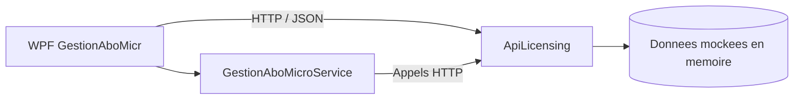

# GestionAbonnementMicrosoft---Stage

Application de gestion des abonnements Microsoft composee de deux projets principaux : une API ASP.NET Core qui expose les donnees metier, et un client WPF qui consomme cette API pour afficher et manipuler les informations.

Le projet simule un outil de suivi commercial et financier autour de clients, abonnements, factures, historique, rapprochement et renouvellement. Les donnees sont actuellement en memoire dans l'API, ce qui permet de tester rapidement l'application sans base de donnees externe.

## Architecture



## Projets du depot

### `ApiLicensing`
API REST en `ASP.NET Core Web API`.

Fonctions principales :
- gestion des clients
- gestion des abonnements
- gestion des factures clients et fournisseurs
- consultation de l'historique client
- consultation des rapprochements
- calculs utilitaires pour le tableau de bord
- page OpenAPI / Scalar en environnement de developpement

### `WpfGestionAboMicr`
Application bureau `WPF` qui sert d'interface utilisateur.

Fonctions principales :
- tableau de bord avec indicateurs globaux
- liste des clients avec recherche, pagination, modification et suppression
- fiche detail client avec abonnements, factures et historique
- gestion des abonnements client
- module de facturation clients et fournisseurs
- ecran de rapprochement avec export CSV
- ecran d'administration pour tester les endpoints de l'API

### `GestionAboMicroService`
Bibliotheque cliente partagee par le WPF.

Elle centralise :
- les appels HTTP vers l'API
- la serialization JSON
- la gestion des erreurs HTTP
- les DTO utilises cote interface

## Technologies utilisees

- .NET 10
- ASP.NET Core Web API
- WPF
- Syncfusion WPF (`DataGrid`, `DataPager`, themes, etc.)
- `Microsoft.AspNetCore.OpenApi`
- `Scalar.AspNetCore`

## Donnees et comportement

L'API utilise des collections en memoire dans `AppService` pour simuler une base de donnees. Les ecritures sont donc temporaires : un redemarrage de l'API remet les donnees initiales.

Le client WPF consomme l'API sur `https://localhost:7085`, ce qui est code en dur dans `GestionAboMicroService`. Il faut donc demarrer l'API avant l'application bureau.

## Fonctionnalites metier

### Clients
- consultation de la liste des clients
- recherche par nom, email, telephone, etat de facturation ou identifiant
- affichage d'un resume simplifie via `summary`
- creation, modification et suppression
- suppression avec confirmation si le client possede des abonnements

### Abonnements
- consultation de tous les abonnements
- filtrage par client
- recherche textuelle
- ajout, modification et suppression
- calcul du nombre total d'abonnements et du nombre d'abonnements actifs

### Facturation
- factures clients
- factures fournisseurs
- consultation par client
- compteur de factures en attente / en retard
- marquage comme payee
- export CSV depuis l'interface WPF

### Tableau de bord
- nombre total de clients
- nombre total d'abonnements
- nombre de renouvellements critiques
- nombre de factures en attente
- repartition des abonnements par type
- evolution mensuelle des abonnements
- liste des renouvellements a venir
- resume financier avec marge brute

### Historique et rapprochement
- historique des actions par client
- rapprochement client / fournisseur avec ecart et pourcentage
- export CSV des rapprochements

## Endpoints principaux de l'API

### Clients
- `GET /api/clients`
- `GET /api/clients/summary`
- `GET /api/clients/{id}`
- `GET /api/clients/recherche?q=...`
- `GET /api/clients/total`
- `POST /api/clients`
- `PUT /api/clients`
- `DELETE /api/clients/{id}?force=true`

### Abonnements
- `GET /api/abonnements`
- `GET /api/abonnements/client/{clientId}`
- `GET /api/abonnements/client/{clientId}/total`
- `GET /api/abonnements/actifs`
- `GET /api/abonnements/total`
- `GET /api/abonnements/recherche?q=...`
- `POST /api/abonnements`
- `PUT /api/abonnements`
- `DELETE /api/abonnements/{id}`

### Factures
- `GET /api/factures`
- `GET /api/factures/{id}`
- `GET /api/factures/client/{clientId}`
- `GET /api/factures/attente/total`
- `GET /api/factures/resume`
- `POST /api/factures`
- `PUT /api/factures`
- `DELETE /api/factures/{id}`

### Factures fournisseurs
- `GET /api/factures/fournisseurs`
- `GET /api/factures/fournisseurs/{id}`
- `POST /api/factures/fournisseurs`
- `PUT /api/factures/fournisseurs`
- `DELETE /api/factures/fournisseurs/{id}`

### Historique
- `GET /api/historique/client/{clientId}`

### Rapprochement
- `GET /api/rapprochement`

### Test
- `GET /api/test/ok`
- `GET /api/test/badrequest`
- `GET /api/test/notfound`
- `GET /api/test/error`

## Ecrans WPF

- `Dashboard` : vue d'accueil avec cartes, graphiques et indicateurs
- `Clients` : liste paginee des clients, recherche, ajout, modification, suppression
- `DetailClient` : fiche complete d'un client avec abonnements, factures et historique
- `ClientAbonnements` : gestion globale des abonnements avec edition inline
- `Facturation` : gestion des factures clients et fournisseurs, export CSV, marquage paye
- `Rapprochement` : consultation et export des rapprochements
- `Renouvellement` : entree de navigation dediee au suivi des renouvellements
- `Admin` : page de test des principaux endpoints de l'API

Le menu lateral est construit avec `MenuTemplate` et `MenuLateral`, et la fenetre principale remplace dynamiquement le contenu central selon la section selectionnee.

## Prerequis

- Windows
- .NET SDK 10
- Visual Studio 2022 ou VS Code avec l'extension C#

## Lancement

### 1. Demarrer l'API

Depuis le dossier `ApiLicensing` :

```bash
dotnet run
```

En developpement, l'API expose aussi Scalar sur :

```text
https://localhost:7085/scalar
```

### 2. Demarrer le client WPF

Depuis `WpfGestionAboMicr/WpfGestionAboMicr` :

```bash
dotnet run
```

Le client se connecte a l'API sur :

```text
https://localhost:7085
```

## Remarques techniques

- Les modeles `Model.cs`, `ViewModel.cs` et `OrderInfo.cs` sont actuellement vides.
- Les fichiers `WeatherForecast.cs` ont ete exclus de la compilation dans l'API.
- Les dates et montants sont stockes sous forme de chaines dans les DTO pour simplifier les ecrans de demo.
- L'application WPF utilise des couleurs et des themes Syncfusion pour les indicateurs visuels.

## Objectif du projet

Ce depot sert de socle de demo pour une application de suivi d'abonnements Microsoft. Il met en avant :
- la separation entre API et client desktop
- l'utilisation de DTO pour les echanges de donnees
- la navigation WPF modulaire
- la consultation et la modification des informations metier principales

## Structure resumee

```text
ApiLicensing/                API REST ASP.NET Core
WpfGestionAboMicr/           Application WPF
WpfGestionAboMicr/GestionAboMicroService/   Client HTTP partage
```